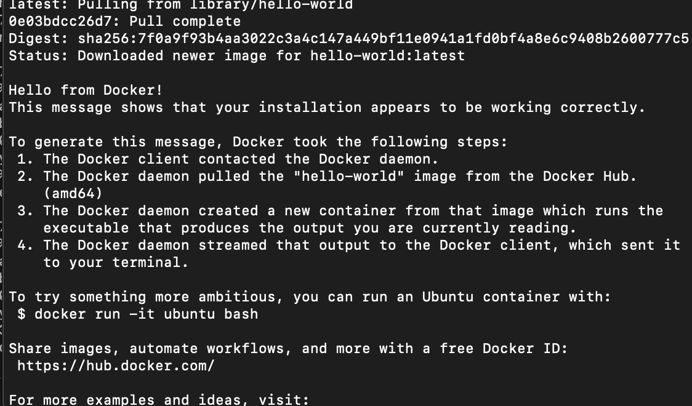

# Welcome
# Steps to perform the Deployment
1. Install Docker.
2. Install Kubernetes on Master.
3. Install Kubernetes on Slave.
4. Add Slave node.
5. Install the Kubernetes Dashboard.
6. Install Helm Wordpress Package.

## Install Docker
In master and slave:
- Install Pre-requisites:
 ```bash
  $ sudo apt-get update
  $ sudo apt-get install \
    apt-transport-https \
    ca-certificates \
    curl \
    gnupg-agent \
    software-properties-common
  ```
- Add Docker Repo
 ```bash
 $ curl -fsSL https://download.docker.com/linux/ubuntu/gpg | sudo apt-key add -
 ```
 ```bash
 # [Optional] Check the GPG key
 $ sudo apt-key fingerprint 0EBFCD88
 ```
-  Let's Select the Stable channel (we don't want any surprise)
```bash
$ sudo add-apt-repository \
   "deb [arch=amd64] https://download.docker.com/linux/ubuntu \
   $(lsb_release -cs) \
   stable"
```
- Instal the docker packages
```bash
$ sudo apt-get update
$ sudo apt-get install docker-ce docker-ce-cli containerd.io
```
- Check the correct install of Docker engine
```bash
$ sudo docker run hello-world
```
if correct it appears: 

Now Docker is installed!
- Configure Docker:
```bash
# Set up the Docker daemon
cat > /etc/docker/daemon.json <<EOF
{
  "exec-opts": ["native.cgroupdriver=systemd"],
  "log-driver": "json-file",
  "log-opts": {
    "max-size": "100m"
  },
  "storage-driver": "overlay2"
}
EOF
# Create Docker service
mkdir -p /etc/systemd/system/docker.service.d
systemctl daemon-reload
systemctl restart docker
# Enable the Docker services
sudo systemctl enable docker
```
## Install Kubernetes on Master
- Install Kubernetes on Master
* Install Kubeadm:
Seguir instrucciones aqí <i src="https://kubernetes.io/docs/setup/production-environment/tools/kubeadm/install-kubeadm/" /> 